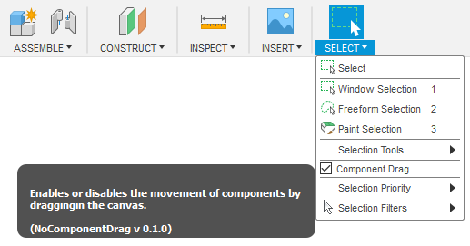

# NoComponentDrag

A Fusion 360 add-in that adds a *Component Drag* option in the parametric design environment. It works just like the *Component Drag* option in the direct editing environment.

## Supported Platforms

* Windows
* Mac OS

## Installation

Download the add-in from the [Releases](https://github.com/thomasa88/NoComponentDrag/releases) page.

Unpack it into `API\AddIns` (see [How to install an add-in or script in Fusion 360](https://knowledge.autodesk.com/support/fusion-360/troubleshooting/caas/sfdcarticles/sfdcarticles/How-to-install-an-ADD-IN-and-Script-in-Fusion-360.html)).

Make sure the directory is named `NoComponentDrag`, with no suffix.

## Usage

Select/unselect *Component Drag* in the Select dropdown to enable/disable component dragging in the parametric environment.

The setting is remembered.

The add-in can be temporarily disabled using the *Scripts and Add-ins* dialog. Press *Shift+S* in Fusion 360™ and go to the *Add-Ins* tab.

## Reporting Issues

Please report any issues that you find on the [Issues](https://github.com/thomasa88/NoComponentDrag/issues) page.

For better support, please include the steps you performed and the result. Also include copies of any error messages.

## Author

This add-in is created by Thomas Axelsson.

## License

This project is licensed under the terms of the MIT license. See [LICENSE](LICENSE).

## More Fusion 360™ Add-ins

[My Fusion 360™ app store page](https://apps.autodesk.com/en/Publisher/PublisherHomepage?ID=JLH9M8296BET)

[All my add-ins on Github](https://github.com/topics/fusion-360?q=user%3Athomasa88)

## Changelog

* v 0.2.1
  * Run on start-up by default
* v 0.2.0
  * Remember *Component Drag* setting
* v 0.10
  * *Component Drag* menu option